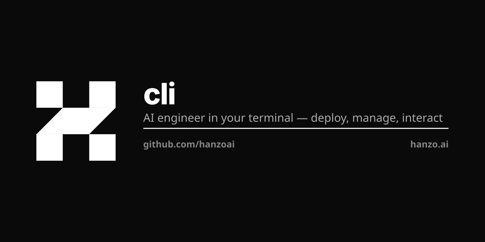

<p align="center"></p>

# @hanzo/cli

The official Hanzo AI CLI — one binary (`hanzo`) that drives your identity, the
compute fleet, dedicated clusters, local model serving, and the whole Hanzo Cloud
API, in a clean `hanzo <resource> <command>` shape.

## Installation

```bash
curl -fsSL https://hanzo.sh | sh     # every platform; verifies the sha256
```

## Quick start

```bash
hanzo                      # a cloud-linked coding session (bare = agent run --mode code)
hanzo agent run "fix the failing test"   # run a managed AI task headless
hanzo auth login           # sign in through Hanzo IAM (OIDC)
hanzo secret scan .        # find credentials/keys before they leave your machine
```

## Command model

`hanzo <resource> <command> [flags]` — one resource noun, verbs beneath it.

| Resource  | What it does                                             |
|-----------|----------------------------------------------------------|
| `agent`   | Run managed AI tasks (`run TASK --mode code\|desktop`)   |
| `auth`    | Manage identities and credentials (Hanzo IAM)            |
| `cluster` | Manage dedicated cloud clusters (managed Kubernetes)     |
| `compute` | Run containers and functions (cloud)                     |
| `config`  | Manage local CLI settings                                |
| `model`   | Serve models from this machine (OpenAI-compatible)       |
| `node`    | Manage machines in the compute fleet                     |
| `runner`  | Provide this machine as a CI runner                      |
| `secret`  | Find exposed secrets in local files                      |
| `serve`   | Run a Hanzo service (`cloud`, or `iam\|kms\|gateway\|…`) |
| `version` | Print the CLI version                                    |

### agent — run managed AI tasks

```bash
hanzo agent run "add pagination to the users endpoint"   # --mode code (default)
hanzo agent run --mode desktop "book the flight in the browser"
hanzo agent run --model enso --backend dev "refactor the parser"
```

`--mode code` is a managed coding workspace (wraps Claude Code / `dev`, attaches
the Hanzo MCP toolset, routes model calls through api.hanzo.ai, and streams the
session to your Hanzo cloud when signed in). `--mode desktop` points the same
agent at browser/desktop control. A bare `hanzo [flags] [task]` is the ergonomic
shortcut for `agent run --mode code`.

### auth — identities and credentials

```bash
hanzo auth login            # OIDC sign-in through Hanzo IAM (or a provider key)
hanzo auth show             # the active identity + org
hanzo auth list             # every identity, the active one marked
hanzo auth use admin/z      # switch the active identity
hanzo auth token            # print the active short-lived access token
hanzo auth logout [--all]
```

### cluster / node — dedicated clusters and the compute fleet

```bash
hanzo cluster create prod --region sfo3   # provision a managed Kubernetes cluster
hanzo cluster list                        # your org's clusters
hanzo cluster use prod                     # select the default cluster

hanzo node join            # register THIS machine in the compute fleet
hanzo node list            # fleet machines, capacity and GPUs
hanzo node leave
```

### model / serve — run things from this machine

```bash
hanzo model serve gemma3-4b          # OpenAI-compatible local endpoint (Hanzo engine)
hanzo serve cloud                    # run the complete Hanzo Cloud API on one listener
hanzo serve iam                      # run one service independently (iam|kms|gateway|storage|pubsub)
hanzo runner start                   # provide this machine as a CI runner (arcd)
```

### secret — local credential scanner

```bash
hanzo secret scan .        # exits non-zero if it finds any key/token/private key
```

A LOCAL scan of your working tree (distinct from cloud `kms`/`connector`, which
STORE secrets). Findings are redacted; drop it into a pre-commit hook or CI.

### config — local settings

```bash
hanzo config list
hanzo config get code.link
hanzo config set code.link false
```

## Cloud API — every capability, as a command

Beyond the resource nouns above, the entire Hanzo Cloud surface is first-class:
`hanzo <product> <resource…> <verb>` (e.g. `hanzo models list`, `hanzo chat
completions …`, `hanzo kms secrets get …`, `hanzo compute machines list`),
generated from the authored OpenAPI specs with real `--help` and typed flags. The
origin comes from the active network, the bearer from the active identity — the
CLI sends only the bearer, and the tenant is derived server-side from the JWT.

## Also included

`hanzo fabric` (run/join hanzo.network with hanzod + query its model cluster),
`hanzo wallet`, `hanzo billing`, `hanzo usage`, `hanzo network`, `hanzo
connector`, `hanzo share`, `hanzo init`, `hanzo dev`, and the TS SDK proxies
(`docs`/`mdx`/`ui`/`mcp`).

## Configuration & credentials

Non-secret settings live in `~/.config/hanzo/config.toml` (edit them with `hanzo
config`). Secrets — IAM tokens, wallet keys, provider API keys — live in the OS
keychain (macOS/Windows) or an owner-only `0600` file (Linux/CI), never in the
config and never in argv.

## Building from source

```bash
git clone https://github.com/hanzoai/cli
cd cli
cargo build --release
cargo test                 # unit + shipped-binary tests
cargo clippy --bin hanzo
```

## Contributing

We welcome contributions! Please see our [Contributing Guide](CONTRIBUTING.md).

## License

MIT © Hanzo AI

## Support

- Documentation: https://docs.hanzo.ai/cli
- GitHub Issues: https://github.com/hanzoai/cli/issues
- Email: support@hanzo.ai

---

Made with ❤️ by [Hanzo AI](https://hanzo.ai)
